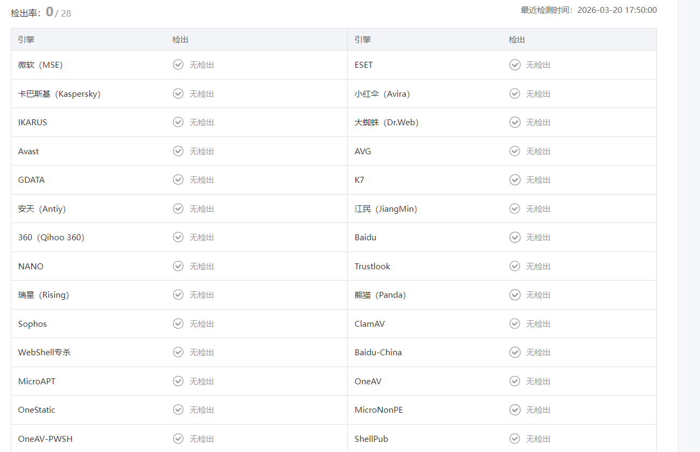
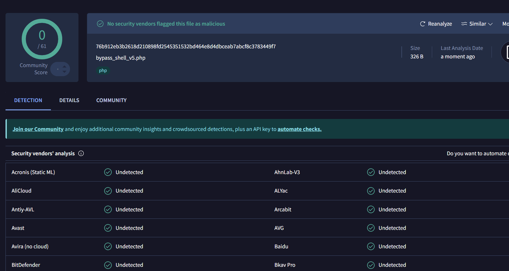
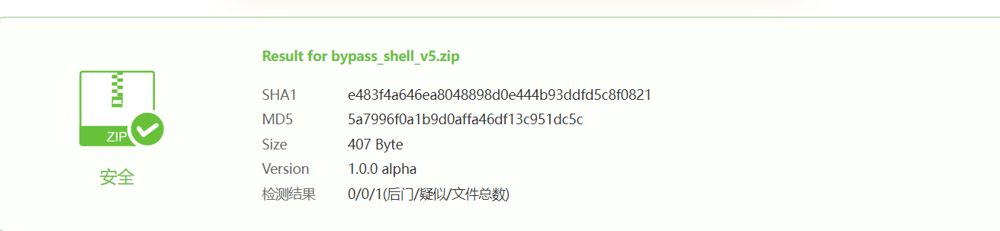

# WebShell 免杀 Skill 开发学习

本项目是一个专注于 **PHP WebShell 免杀技能开发** 的学习仓库，通过 Trae IDE 的多 Agent 协作机制，探索和实践如何编写高效的免杀 Skill。

## 项目简介

本项目旨在学习和研究如何利用 AI Agent 技术（特别是 Trae IDE 的多 Agent 协作能力）来生成能够绕过主流安全检测的 PHP WebShell。项目的核心价值在于：

- 探索自动化免杀代码生成的技术边界
- 深入理解安全检测与免杀对抗的原理
- 学习和掌握 Skill 开发的方法论

## 功能展示

### 效果演示

以下是项目运行时的效果展示：

## 技术栈

- **AI 框架**: Trae IDE (Multi-Agent System)
- **目标语言**: PHP
- **核心技能**: WebShell 免杀技术
- **开发工具**: Claude Code / Claude.ai

## 学习目标

通过本项目的学习，您将掌握：

1. **Skill 开发基础**: 了解如何编写高效的 Trae Skill
2. **多 Agent 协作**: 掌握如何利用多个 Agent 协同完成复杂任务
3. **免杀技术原理**: 深入理解 WebShell 检测机制与免杀技术
4. **安全对抗思维**: 建立正确的安全对抗认知

## 使用说明

### 前提条件

- 安装 Trae IDE 或使用 Claude Code/Claude.ai
- 具备 PHP 基础编程知识
- 了解 Web 安全基本概念

### 快速开始

1. 克隆本仓库到本地
2. 阅读项目中的 Skill 示例代码
3. 尝试运行和调试免杀生成器
4. 分析生成结果，改进 Skill 设计

## 免责声明

本项目仅供 **安全研究** 和 **学习交流** 之用，请勿将其用于任何非法目的。使用本项目产生的任何后果由使用者自行承担。

## 贡献指南

欢迎提交 Issue 和 Pull Request！如果您有更好的免杀思路或 Skill 改进方案，请随时贡献您的代码。

## 许可证

本项目仅供学习交流使用，请勿用于商业目的。

---

> **警告**: 请仅在授权的环境中进行安全测试，遵守相关法律法规。
